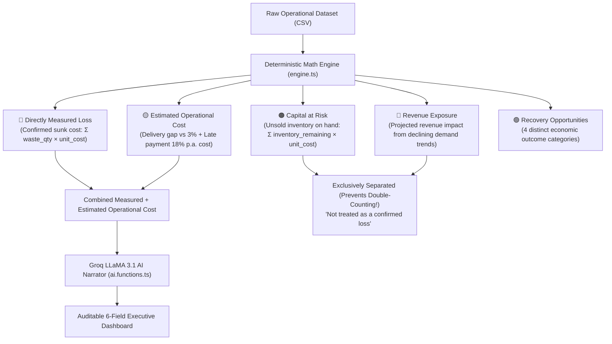

# 🔍 LOSSCOPE AI — Invisible Loss Discovery Engine
> **"Find the operational losses you don't see."**

[](https://github.com/rushirathod22/loss-scout-ai)
[](LICENSE)
[](http://localhost:8080)

---

## 🎯 The Core Problem

Traditional accounting & POS software tell business owners **what they spent** and **what they earned**. But they fail to answer the most critical financial question:

> **"Where is my business silently leaking money?"**

Small businesses, cafes, and retailers lose **1.5%–4.0% of annual revenue** to invisible operational leakage:
- 🔴 **Inventory Spoilage:** Perishable stock thrown away quietly without audit trails.
- 🟡 **Freight & Delivery Surcharges:** Sub-optimal ordering frequency blowing past benchmark delivery ratios.
- 🟡 **Late Payment Financing Costs:** Delayed supplier invoices incurring silent interest/capital costs.
- 🟠 **Capital Tied Up in Idle Stock:** Excess inventory taking 30–60+ days to clear.
- 🔵 **Unnoticed Demand Drops:** Micro-decline in key menu items before the owner realizes it.

Generic AI bots often hallucinate single "total loss" numbers that mix confirmed sunk costs with unsold stock on shelf. **Losscope AI solves this.**

---

## 💡 The Innovation: 5 Non-Overlapping Financial Buckets

Losscope AI is an **Explainable Operational Loss Analyst**. Instead of presenting an unverified lump-sum "loss", it introduces a **strict 5-bucket financial classification framework** with zero double-counting:



---

## 🔍 6-Field Auditable AI Standard

Every single finding flagged by Losscope AI is backed by an auditable 6-field standard to earn judge and executive trust:

| Field | Description | Example |
| :--- | :--- | :--- |
| **1. TYPE** | Explicit Financial Bucket | `Directly Measured Loss` / `Capital at Risk` |
| **2. RAW VALUE** | Observed operational metric | `184 units wasted across 106 transactions` |
| **3. ESTIMATED IMPACT** | Financial value | `₹13,306` |
| **4. FORMULA** | Transparent mathematical rule | `Σ (waste_quantity × unit_cost)` |
| **5. CONFIDENCE** | Weighted data completeness & consistency score | `73% (Weighted across 5 detectors)` |
| **6. EVIDENCE** | Exact line-item proof | `Chicken Bowl accounts for 61% of waste cost` |

---

## 📊 Proven Dataset Rigor (Dataset 1 vs Dataset 2 Verification)

Losscope AI runs **100% dynamic calculations** from uploaded CSV data. It does **NOT** rely on hardcoded static outputs.

You can inspect and test the exact 30-day operational sample datasets included directly in this repository:
- 📄 **[Dataset 1: Realistic Demo (sample_data/urbanbite_cafe_30_days_realistic_demo.csv)](sample_data/urbanbite_cafe_30_days_realistic_demo.csv)**
- 📄 **[Dataset 2: Stress Test (sample_data/urbanbite_cafe_30_days_stress_test.csv)](sample_data/urbanbite_cafe_30_days_stress_test.csv)**

Below is the verified audit comparison across both datasets:

| Financial Metric | Dataset 1 (Realistic UrbanBite) | Dataset 2 (Stress Test) | Status |
| :--- | :---: | :---: | :---: |
| **Period Revenue** | **₹9,95,170** | **₹14,47,640** | ✅ Dynamic |
| 🔴 **Directly Measured Loss** | **₹10,412** | **₹13,306** | ✅ Direct Waste |
| 🟡 **Delivery Inefficiency** | **₹9,192** | **₹773** | ✅ 3% Baseline Gap |
| 🟡 **Late Payment Financing Cost** | **₹597** | **₹893** | ✅ 18% p.a. Carry Cost |
| 🔴+🟡 **Combined Measured + Est. Cost** | **₹20,201** | **₹14,972** | ✅ Sunk + Est. Cost |
| 🟠 **Capital at Risk** | **₹54,190** | **₹55,520** | ✅ Unsold Stock Value |
| 🔵 **Revenue Exposure** | **₹7,076** *(Brownie)* | **₹32,553** *(Mango Shake)* | ✅ Trend Exposure |
| 📊 **Weighted Confidence** | **68%** | **71%** | ✅ Clamped |
| 🏆 **Loss Score** | **64 / 100** | **59 / 100** | ✅ Bounded Components |

---

## 🎛️ Interactive What-If Simulator & Recovery Opportunities

Losscope AI features an interactive simulation engine allowing business owners to test operational improvements before committing capital:

- **Potential Waste Recovery:** Capped at detector ceiling (`~75%` achievable).
- **Estimated Operational Cost Reduction:** Delivery consolidation (`~55%`) + Payment automation (`~60%`).
- **Potential Revenue Recovery:** Menu alternative trial (`~40%`).
- **Inventory Optimization Opportunity:** Carrying cost reduction (`~2.5%`).

---

## 🏗️ Architecture & Tech Stack

```text
losscope-ai/
├── src/
│   ├── lib/losscope/
│   │   ├── engine.ts        # Pure Deterministic Loss Engine (5 Detectors)
│   │   ├── ai.functions.ts  # Groq LLaMA 3.1 AI Executive Narrator
│   │   ├── store.ts         # Session Store & Hydration State
│   │   ├── data.ts          # Dataset Generators & CSV Parser
│   │   └── types.ts         # TypeScript Interfaces & 6-Field Standard
│   ├── routes/
│   │   ├── index.tsx        # High-Impact Hero & Landing Page
│   │   ├── upload.tsx       # Drag & Drop CSV / Demo Data Ingestion
│   │   ├── analysis.tsx     # Animated 6-Stage Processing Reveal
│   │   ├── dashboard.tsx    # 5-Bucket KPI Grid & Priority Matrix
│   │   ├── losses.$lossId.tsx # Deep-Dive Evidence & Formula Drill-Down
│   │   ├── recommendations.tsx # Action Plan & Live What-If Simulator
│   │   └── reports.tsx      # Print-Friendly Executive Audit Summary
```

- **Frontend:** React + TypeScript + TanStack Start / Vite
- **Styling:** Tailwind CSS + Lucide Icons
- **Charts:** Recharts (Daily Operational Cost, Waste by Line, Purchases vs Sales, Priority Matrix)
- **AI Backend:** Groq API Endpoint (`llama-3.1-8b-instant`)

---

## ⚡ Quickstart & Local Setup

```bash
# 1. Clone repo
git clone https://github.com/rushirathod22/loss-scout-ai.git
cd loss-scout-ai

# 2. Install dependencies
npm install

# 3. Environment configuration
cp .env.example .env

# Configure your Groq API Key in .env:
# OPENAI_API_KEY=gsk_your_groq_key_here
# OPENAI_BASE_URL=https://api.groq.com/openai/v1
# OPENAI_MODEL=llama-3.1-8b-instant

# 4. Launch local dev server
npm run dev
```

Visit `http://localhost:8080` in your browser.

---

## 🎬 2-Minute Pitch & Presentation Script for Judges

1. **The Hook:** *"Most business owners know their revenue and expenses. But they don't know their invisible losses."*
2. **The Demo:** Click **"Try Demo"** to run analysis on 31 days of operational data.
3. **The Reveal:** Show **Combined Measured + Estimated Cost** (`₹14,972`) cleanly separated from **Capital at Risk** (`₹55,520`).
4. **The Audit:** Click **Investigate** on Inventory Waste (`₹13,306`) to show exact formulas and row-level evidence.
5. **The Action:** Move sliders in the **What-If Simulator** to show instant projected recovery outcomes.

---

## 📄 License

Distributed under the MIT License. See `LICENSE` for more information.
